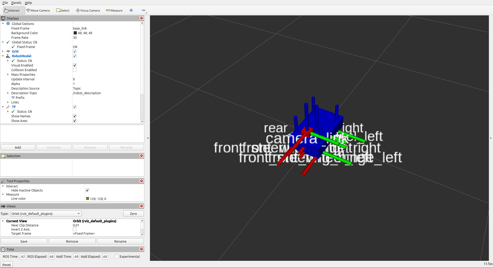

# JetRacer Description Package

A ROS2 Jazzy robot description package for simulating the Nvidia JetRacer autonomous vehicle. This package provides URDF/Xacro robot models, launch files, and control nodes for visualization in RViz2 and simulation in Gazebo Harmonic.

> **Note**: This package uses `teleop_twist_keyboard` for keyboard control (standard ROS2 i/j/k/l keys), not direct WASD input. The launch files have been named accurately to reflect their actual functionality.

## Features

- **Complete Robot Model**: Detailed URDF/Xacro description with Ackermann steering geometry
- **Visualization**: RViz2 integration with custom configurations
- **Control Systems**: WASD keyboard control and teleop integration
- **Simulation Ready**: Compatible with Gazebo Harmonic
- **Odometry Publishing**: Real-time pose estimation and TF broadcasting

## Package Structure

```
jetracer_description/
├── config/                    # Configuration files
│   └── jetracer_working.rviz  # RViz configuration
├── jetracer_description/      # Python package
│   ├── __init__.py
│   └── simple_controller.py       # Robot controller node
├── launch/                    # Launch files
│   ├── display_teleop.launch.py   # Complete setup with keyboard control
│   ├── display_basic.launch.py    # Basic display (requires separate teleop)
│   ├── display_working.launch.py  # Alternative with GUI
│   ├── gazebo.launch.py           # Gazebo simulation
│   └── teleop.launch.py           # Standalone teleop keyboard
├── meshes/                    # 3D mesh files
├── scripts/                   # Utility scripts
├── urdf/                      # Robot description files
│   └── jetracer.xacro        # Main robot URDF
└── worlds/                    # Gazebo world files
```

## Requirements

- **ROS2 Jazzy**
- **Gazebo Harmonic**
- **Python 3.10+**

### Dependencies

```bash
sudo apt update
sudo apt install -y \
    ros-jazzy-robot-state-publisher \
    ros-jazzy-joint-state-publisher \
    ros-jazzy-joint-state-publisher-gui \
    ros-jazzy-xacro \
    ros-jazzy-gazebo-ros \
    ros-jazzy-gazebo-ros-pkgs \
    ros-jazzy-ros-gz-bridge \
    ros-jazzy-teleop-twist-keyboard \
    ros-jazzy-rviz2
```

## Installation

1. **Create workspace and clone**:
   ```bash
   mkdir -p ~/ros2_ws/src
   cd ~/ros2_ws/src
   git clone <repository-url> jetracer_description
   cd ~/ros2_ws
   ```

2. **Install dependencies**:
   ```bash
   rosdep install --from-paths src --ignore-src -r -y
   ```

3. **Build the package**:
   ```bash
   colcon build --packages-select jetracer_description
   source install/setup.bash
   ```

## Usage

### 1. Complete Setup with Keyboard Control (Recommended)

Launch the robot with teleop keyboard control in a separate window:

```bash
ros2 launch jetracer_description display_teleop.launch.py
```

This will:
- Start the robot visualization in RViz2
- Open a separate terminal window for teleop_twist_keyboard control
- Use **i/j/k/l** keys for movement (standard ROS teleop controls)
  - **i**: Move forward
  - **k**: Move backward  
  - **j**: Turn left
  - **l**: Turn right
  - **u/o**: Forward left/right
  - **m/.**: Backward left/right

### 2. Basic Display (Requires Manual Teleop)

Launch just the robot display:

```bash
# Terminal 1: Launch robot display
ros2 launch jetracer_description display_basic.launch.py

# Terminal 2: Launch teleop control separately  
ros2 run teleop_twist_keyboard teleop_twist_keyboard
```

### 3. Alternative Control Methods

**With Joint State Publisher GUI**:
```bash
ros2 launch jetracer_description display_working.launch.py
```

**Standalone teleop control**:
```bash
ros2 launch jetracer_description teleop.launch.py
```

### 4. Gazebo Simulation

Launch in Gazebo Harmonic:
```bash
ros2 launch jetracer_description gazebo.launch.py
```

## Robot Specifications

- **Wheelbase**: 0.32m
- **Track Width**: 0.24m  
- **Wheel Diameter**: 0.1m
- **Steering Type**: Ackermann
- **Sensors**: Camera, IMU
- **Maximum Steering Angle**: ±0.5 radians

## Topics

### Published Topics
- `/joint_states` (sensor_msgs/JointState): Joint positions and velocities
- `/odom` (nav_msgs/Odometry): Robot odometry data
- `/tf` (tf2_msgs/TFMessage): Transform tree

### Subscribed Topics
- `/cmd_vel` (geometry_msgs/Twist): Velocity commands

## Frames

- **odom**: Odometry frame (fixed world frame)
- **base_link**: Robot base frame
- **camera_link**: Camera sensor frame
- **imu_link**: IMU sensor frame

## Configuration

### RViz Configuration
The package includes a pre-configured RViz setup (`config/jetracer_working.rviz`) with:
- Robot model visualization
- TF tree display
- Odometry path tracking
- Joint state monitoring

### Control Parameters
Adjust control parameters in the launch files:
- `update_rate`: Control loop frequency (default: 30Hz)
- `linear_scale`: Linear velocity scaling
- `angular_scale`: Angular velocity scaling

## Troubleshooting

### Robot Not Visible in RViz
1. Check that the correct RViz config is loaded
2. Verify the fixed frame is set to `odom`
3. Ensure robot_state_publisher is running

### Keyboard Control Not Working
1. Verify the teleop terminal window has focus
2. Check that `/cmd_vel` topic is being published:
   ```bash
   ros2 topic echo /cmd_vel
   ```
3. Ensure the controller node is running:
   ```bash
   ros2 node list | grep controller
   ```

### Build Errors
1. Make sure all dependencies are installed
2. Clean and rebuild:
   ```bash
   rm -rf build/ install/ log/
   colcon build --packages-select jetracer_description
   ```

## Development

### Adding New Features
1. Robot modifications: Edit `urdf/jetracer.xacro`
2. Control logic: Modify `jetracer_description/simple_controller.py`
3. Launch configurations: Create new files in `launch/`

### Testing
Run the included tests:
```bash
colcon test --packages-select jetracer_description
```

## Contributing

1. Fork the repository
2. Create a feature branch
3. Make your changes
4. Test thoroughly
5. Submit a pull request

## License

This project is licensed under the Apache-2.0 License - see the LICENSE file for details.

## Acknowledgments

- Based on the Nvidia JetRacer platform
- Built for ROS2 Jazzy and Gazebo Harmonic
- Inspired by autonomous vehicle research

## Screenshots



*JetRacer robot visualization in RViz2 with WASD control*
